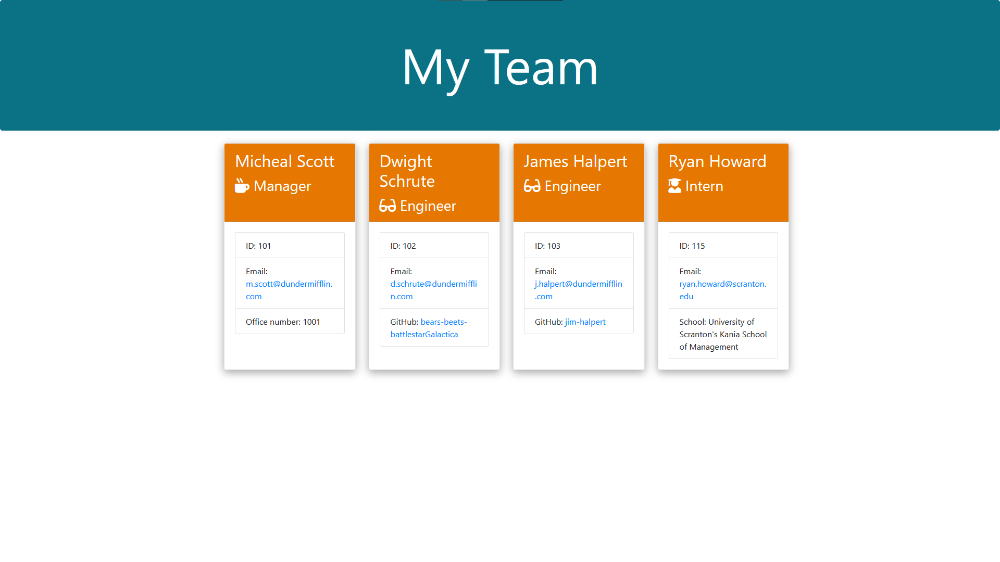

# Team Profile Generator

[](https://opensource.org/licenses/MIT)

## Description

This repository contains code for a Team Profile Generator that renders a HTML webpage about employees for a software engineering team and displays summaries for each person using user inputs through a CLI.

## Table of Contents

- [Description](#description)
- [Installation](#installation)
- [Usage](#usage)
- [License](#license)
- [Contributing](#contributing)
- [Tests](#tests)
- [Questions](#questions)

## Installation

Before using this Team Profile Generator, please ensure that [Node.js](https://nodejs.org/en/) is installed,
then ensure that all necessary dependencies are installed by running the following command:

```bash
npm install
```

## Usage

In order to use this Team Profile Generator please do the following:

```md
- Navigate to the project's root folder
- Run node index.js
- Answer all the prompts
- When prompted, select an employee or generate the HTML by selecting the "Finished building the team" option.
- Check generated HTML page in the output folder.
```

## Team Profile Generator Preview



## License

This project is licensed under the MIT license.

## Contributing

To contribute to this project, fork and clone this repository locally, then submit a pull request.

## Tests

In order to run tests on this project please run the following command:

```bash
npm test
```

## Questions

This README was generated using the [README Generator](https://github.com/ktadique/README-Generator)!

If you have any questions regarding this project, please contact me via [email](mailto:kch.tadique@gmail.com)<br>
Or check out my GitHub **@[ktadique](https://github.com/ktadique)** for my other projects!
